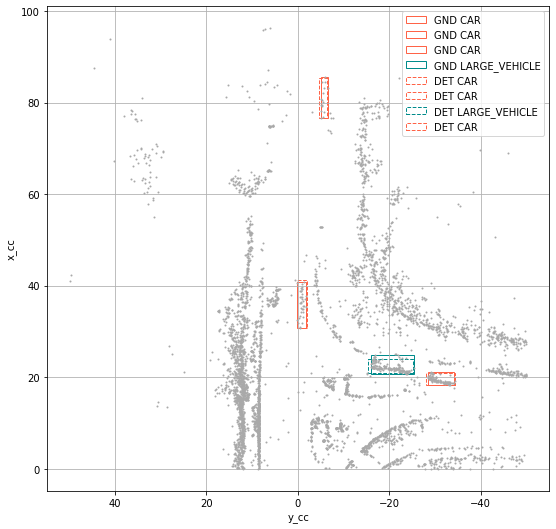
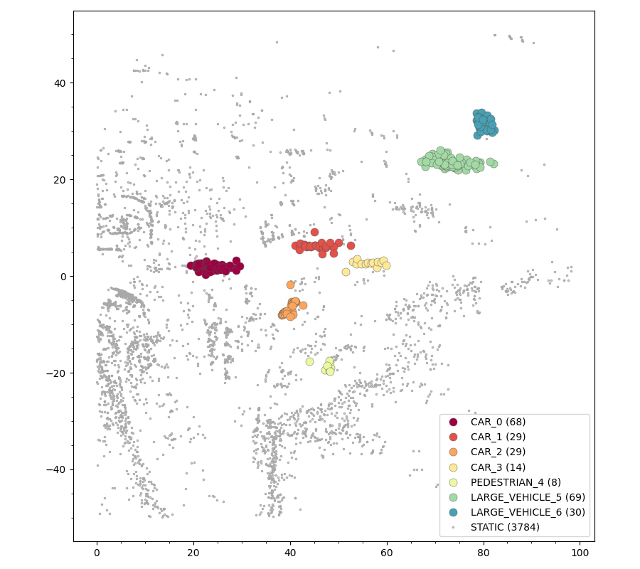
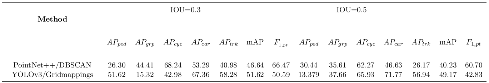
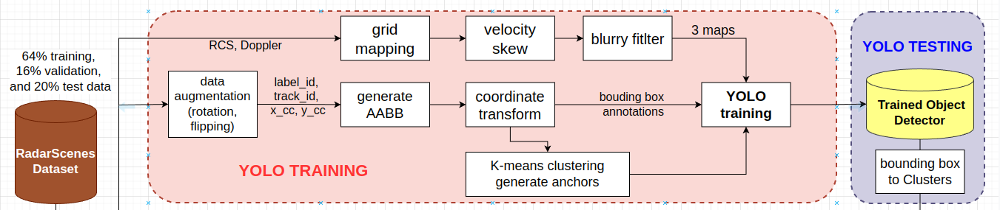
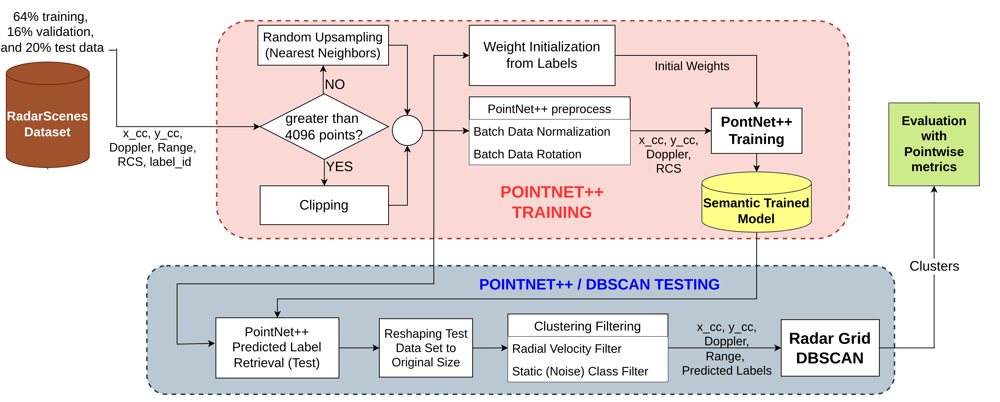

# Radar Object Detection with Deep Learning
## Introduction
This thesis aims to reproduce and improve a paper about dynamic road
user detection on 2D bird’s-eye-view radar point cloud in the context of autonomous
driving. We choose RadarScenes, a recent large public dataset, to train and test deep neural networks. We adopt the two best approaches, the image-based object detector with grid mappings approach and the semantic segmentation-based clustering
approach. YOLO v3 and Pointnet++ are the deep networks for two approaches
respectively. 

## Models
There are two implemented models, see the details in `yolo/README.md` and `PointNet/README.md`
### YOLO + Grid Mappings
It is natural to preprocess
point clouds into image-like datatype and utilize image-based object detector to
process it. Here we choose YOLO v3. See an example of detection. 
### PointNet++ & DBSCAN

We use this pipeline to cluster the predicted labels of the RadarScenes points. This means that we extract objects from the raw points dataset by passing them through a semantic segmentation network and then, a clustering algorithm. For the network we use *PointNet++* and for the clustring algorithm we use *Radar DBSCAN*. See an example of the output 

## Metrics
We also adapt the evaluation metrics, IOU, F1, and mAP for points clusters so that both approaches’ output can be comparable. 

We compared them using the points as the base for calculations. This means that a pointwise-IoU is implemented along with a mAP and F1 specially modified for this dataset and models. 

The performance metrics (AP for each class, mAP, and F1) obtained for each models are:



## Dataset
Both approaches are trained and evaludated on the public dataset, [RadarScenes](https://zenodo.org/record/4559821#.Yt200dJBxH4). It is a real-world radar point cloud data set for automotive applications.
### Train,Validation and Test set split
1. Download [RadarScenes](https://zenodo.org/record/4559821/files/RadarScenes.zip?download=1)
2. go to the root path where you put RadarScenes
```
mkdir train
mkdir test
mkdir validation
```
3. Move sequences into three folders by the ratio train:val:test=64:16:20
4. Copy `sensors.json` and `sequences.json` into three folders  

Note: In *Object detection for automotive radar
point clouds – a comparison*, "a brute force approach was used to determine the best split among $10^7$ sequence combinations". Here we randomly choose sequences for train, validation and test set.

## Build Local Environment
1. Clone this repo
2. Create a virtual environment
```
virtualenv radar
source radar/bin/activate
```
2. Use `requirements.txt` to install all the packages:
```
pip install -r requirements.txt
```

## Static Files
A snippet is a basic unit of training and test sample, which consist of 500 ms accumulated radar data. To generate snippets on the fly, static files record the information of a snippet 
 1. the index of the first frame of the snippet in its sequence 
 2. the number of frames in the snippet. 

E.g., Dataloader in `dataset.py` will read `train.txt` to extract snippet from each sequence. Each line corresponds to a sequence. Each pair of number corresponds to a snippet.
### Generate static files 
- run `snippet.py` to generate `train.txt`. The second parameter is the length of a snippet.
```
python3 snippet.py -d folder_of_three_sets -t train -l 500000 
``` 
- replace `train` with `test`, `validation` to generate `test.txt`, `validation.txt`
- All static files are saved in `./static`, shared by both the YOLO model and the PointNet++ model
- This step is only needed once before all the training.  
- The final model is trained on the combination of the training set and the validation set.


# YOLO with Grid Mappings
## Introduction
See the pipeline in the following picture.

## Generate Anchors (optional)
1. run `python anchors.py` to write annotations into txt files, each txt file corresponds to a snippet;
2. `find "$(pwd)" -name '*.txt'  > ../train.txt` write all txt files paths into a train.txt
3. Use [Darknet](https://github.com/AlexeyAB/darknet) repo to generate new anchors. `./darknet detector calc_anchors obj.data -num_of_clusters 9 -width 608 -height 608`
4. Copy and paste the result in 3 to line 609, 695, 782 in yolov3.cfg

This step is only needed once before all the training. If you are unfarimliar with the repo above, **skip it**!
## Configurations
- `./yolo/config/yolov3.cfg` defines the model architecture.
- Edit `batch` and `subdivision` to change batch size and how many images are sent to train each time.
- Edit `steps` to adjust learning rate scheme
- `./yolo/config/custom.data` specifies the path of the training and validation set and their corresponding static files.

## YOLO Training
1. set python env
```
export PYTHONPATH=.
```
2. ALWAYS first run `snippet.py` before training
3. Change paths to the training/testing/validation sets in `./yolo/config/custom_short.data`
3. Train the model from scratch for 100 epochs
```
python3 -u yolo/train.py -e 100 \
            --checkpoint_path 500ms\
            --checkpoint_interval 10\
            --data yolo/config/custom_short.data \
            --model yolo/config/yolov3.cfg \
            --blurry \
            --skew
```
or training from the breakpoint
```
python3 yolo/train.py -e 500 --pretrained_weights yolo/checkpoints/yolov3_ckpt_300.pth
```
Note: If you get `RuntimeError: CUDA out of memory.` while runing, it is becuase of CUDA does not have enough memory. Change the above with `--model yolo/config/yolov3-tiny.cfg \`. YOLOvf3-tiny is a light-weight model with less layers and therefore consume less memory. Of course, it will lead to decreases in the performance.

6. Use Tensorboard to monitor the training
```
tensorboard --logdir yolo/logs
```
Checkpoints are saved in `yolo/checkpoints`.  

## YOLO Detection and Visualization
Try `yolo/detect.ipynb`.   
`yolo/checkpoints/yolov3_ckpt_50.pth` is the model weights trained on 500ms snippets for 50 epochs. It achieves the best test score.

## YOLO Test
1. Test locally
```
export PYTHONPATH=.
python3 -u yolo/pointwiseTest.py \
            --data yolo/config/custom_short.data \
            --model yolo/config/yolov3.cfg\
            -w yolo/checkpoints/500ms/yolov3_ckpt_50.pth\
            --iou_thres 0.5\
            --batch_size 1\
            --nms_thres 0.5
```
## Test Result
An example of the output.
```
+-------+------------------+---------+
| Index | Class            | AP      |
+-------+------------------+---------+
| 0     | CAR              | 0.71769 |
| 1     | PEDESTRIAN       | 0.13379 |
| 2     | PEDESTRIAN_GROUP | 0.37658 |
| 3     | TWO_WHEELER      | 0.65931 |
| 4     | LARGE_VEHICLE    | 0.56941 |
+-------+------------------+---------+
---- mAP 0.49136 ----
```

## Debug
If the trained model doesn not detect objects as intended, try to train a model on a snippet to overfit it. Start with creating a short version of `static/train.txt` by running `snippet.py` on only a sequence.If the overfitting success, go back to large-scale training.

# PointNet++ and DBSCAN in Radar Points
Instance segmentation using **PointNet++** semantic segmenation network and a **Radar Based DBSCAN** clustering algorithm.

This implementation works on the RadarScenes point cloud data set.



## Dataset Preparation
See the details in the top README file.

## PointNet++ Training

1. Set python env at the root folder of the project, i.e., `./<project_folder>/` and copy the next command to the terminal.
    ```
    export PYTHONPATH=.
    ```
2. ALWAYS run first `snippet.py` before training as mentioned above.

3. Run `train_radar_semseg_msg.py` including paths and hyper-parameters as follows 
    
    (example of the run command below this list):

    - Point to the radarscenes train folder you have created with:

        ```
        --train_dataset_path RS_data_sample/train_small 
        ```

        which is the one you have created in how to create the dataset section above.

    - Point to the train snippet text file you have created with:
        ```
        --train_snippet_path static/train_small.txt
        ```

    - Specify the radarscenes validation folder you have created with: 
        ```
        --valid_dataset_path RS_data_sample/test_small
        ``` 
        which is the one you have created in how to create the dataset section above.

    - Point to the validation snippet text file you have created with:
        ```
        --valid_snippet_path static/test_small.txt
        ```

    - Name a logging directory: 
    
        ```
        --log_dir sample_training3
        ```
        which is the file created automatically in path `./PointNet/Pnet_pytorch/log/sem_seg/` while running. 
    
        The logging directory contains: 
        - `checkpoints` folder (containing `model.pth` and `best_model.pth`)
        - `logs` folder (containing a `.txt` file with the terminal's output)
        - A copy of the architecture used e.g. `pnet2_radar_semseg_msg.py`.
        - A tensorboard folder to check plots (accuracy, loss, f1, confusion matrix),and a copy of the pointnet tools used e.g. `pointnet2_utils.py`. 

    - Select an EXISTING architecture model:
         ```
         --model pnet2_radar_semseg_msg
         ```
         By default, the folder contains this one: `pnet2_radar_semseg_msg.py` in `models` folder.

    - Select the batch size. By default is `4`, and if getting runtime error because of GPU memory then, reduce this number:
    
        ```
        --batch_size 4
        ```

    - Select the number of epochs. By default, `30`:
        ```
        --epoch 30
        ``` 

    - Select the intial learning rate. By default, `0.0004`:
        
        ```
        --learning_rate 0.0004
        ```

    - Select the GPU used. By default, `0`. Always check which one you want to use and if you have configured CUDA first (not included in this repository):
    
        ```
        --gpu 0
        ```

    - Select the optimizer, `SGD` or `Adam`. By default, `Adam`:
    
        ```
        --optimizer Adam
        ```

    - Select the weight decay rate. By default, `1e-4`:
        
        ```
        --decay_rate 1e-4
        ```

    - Select the number of points. By default `4096`: 
        
        ```
        --npoint 4096
        ```

    - Select the step size. By default, every `10` epochs:
        
        ```
        --step_size 10
        ```

    - Select the learning rate decay rate. By default `0.6`: 
        
        ```
        --lr_decay 0.6
        ```

    - Call the recommended jitter data augmentation technique for training with:
    
        ```
        --jitter_data
        ``` 
        for whether or not to jitter the points in each snippet (recommended to use it always for optimal performance). 
    
        When called, the jitter method (`jitter_point_cloud_noVR_dataset`) in `provider.py` will be triggered and applied in `pnet_dataset.py` at the data gathering stage.

    - Select other data augmentation techniques with:
    
         ```
         --data_aug None
         ``` 
         There are: `rotation`, `jitter`, `scale`, `dropout` (Refer to `provider.py` for more info and how these methods are based on). By default, `None`.  

    - Call:
    
        ```
        --debug
        ``` 
        to perform training over a small dataset. When called, you can select:
        - the number of snippets for training and validation:
            ```
            --numel_train_subset 40
            ```
            and
            ```
            --numel_valid_subset 33
            ```
        - from which starting indices (from  the snippets indices' files you have created) you want to perform the training in training and validation:
            
            ```
            --train_index_start 20
            ```
            and 
            ```
            --valid_index_start 30
            ``` 
        
        By default the values are: `train_index_start = 20`, `valid_index_start = 30`, `numel_train_subset = 40`, and `numel_valid_subset = 33`. 

    - Call:
        ```
        --plot_labels
        ``` 
        for a prediction visualization of the labels in the subsets (using matplotlib). This works only when `--debug` is called to prevent plotting the whole dataset.

### Examples for Running

1. Local training

    1. Full training with minimal parameters (most default values):

        ```
        python PointNet/Pnet_pytorch/train_radar_semseg_msg.py \
        --train_dataset_path RS_data_sample/train_small \
        --train_snippet_path static/train.txt \
        --valid_dataset_path RS_data_sample/test_small \
        --valid_snippet_path static/test_small.txt \
        --log_dir sample_training_1
        ```
    2. Debug training with subset and minimal parameters (most default values):

        ```
        python PointNet/Pnet_pytorch/train_radar_semseg_msg.py \
        --train_dataset_path RS_data_sample/train_small \
        --train_snippet_path static/train_small.txt \
        --valid_dataset_path RS_data_sample/test_small \
        --valid_snippet_path static/test_small.txt \
        --log_dir sample_training_2 \
        --debug \
        --idxs_snippets_tr 3 \
        --num_snippets_tr 6 \
        --idxs_snippets_vl 2 \
        --num_snippets_vl 4
        ```
    3. Full training with some custom parameters:

        ```
        python PointNet/Pnet_pytorch/train_radar_semseg_msg.py \
        --train_dataset_path RS_data_sample/train_small \
        --train_snippet_path static/train_small.txt \
        --valid_dataset_path RS_data_sample/test_small \
        --valid_snippet_path static/test_small.txt \
        --model pnet2_radar_semseg_msg \
        --log_dir sample_training_3 \
        --npoint 3000 \
        --step_size 20 \
        --epoch 80 \
        --batch_size 2 \
        --learning_rate 0.0065 \
        --lr_decay 0.80
        ```
    4. Debug training with some custom parameters:

        ```
        python PointNet/Pnet_pytorch/train_radar_semseg_msg.py \
        --train_dataset_path RS_data_sample/train_small \
        --train_snippet_path static/train_small.txt \
        --valid_dataset_path RS_data_sample/test_small \
        --valid_snippet_path static/test_small.txt \
        --debug \
        --idxs_snippets_tr 3 \
        --num_snippets_tr 6 \
        --idxs_snippets_vl 2 \
        --num_snippets_vl 4 \
        --model pnet2_radar_semseg_msg \
        --log_dir sample_training_4 \
        --npoint 3000 \
        --step_size 20 \
        --epoch 80 \
        --batch_size 2 \
        --learning_rate 0.0065 \
        --lr_decay 0.80
        ```
    5. Full training with some custom parameters and data augmentation (Recommended: jittering. Alternate: rotation):

        ```
        python PointNet/Pnet_pytorch/train_radar_semseg_msg.py \
        --train_dataset_path RS_data_sample/train_small \
        --train_snippet_path static/train_small.txt \
        --valid_dataset_path RS_data_sample/test_small \
        --valid_snippet_path static/test_small.txt \
        --model pnet2_radar_semseg_msg \
        --log_dir sample_training_5 \
        --npoint 3000 \
        --step_size 20 \
        --epoch 80 \
        --batch_size 2 \
        --learning_rate 0.0065 \
        --lr_decay 0.80 \
        --jitter_data \
        --data_aug rotation
        ```


## PointNet++ and DBSCAN Testing


1. Set python env at the root fodler of the project, i.e., `./<project_folder>/`.
    ```
    export PYTHONPATH=.
    ```
2. ALWAYS run first `snippet.py` before training as mentioned above.

3. Run `test_radar_semseg.py` including paths and hyper-parameters as follows (example of the run command below this list):

    - Point to the radarscenes test folder you have created with 
    
        ```
        --test_dataset_path RS_data_sample/test_small
        ```
        which is the one you have created in how to create the dataset section above.
    
    - Point to the test snippet text file you have created with:
    
        ```
        --test_snippet_path <testing_snippet_path/test.txt>
        ```

    - Select an EXISTING logging directory:
        
        ```
        --log_dir sample_training_1
        ``` 
        which is the file created automatically in path `./PointNet/Pnet_pytorch/log/sem_seg/` after training. 
        
        The logging directory contains: 
        - `checkpoints` folder (containing `model.pth` and `best_model.pth`)
        - `logs` folder (containing a `.txt` file with the terminal's output)
        - A copy of the architecture used e.g. `pnet2_radar_semseg_msg.py`.
        - A tensorboard folder to check plots (accuracy, loss, f1, confusion matrix),and a copy of the pointnet tools used e.g. `pointnet2_utils.py`. 

    - Select an EXISTING DBSCAN config file with:
    
        ```
        --dbscan_config_file config
        ```
        Modify the contents of this config file for different results. 
        
        This file contains the DBSCAN parameters: `e_xyv`, `e_v`, minimum points per class (`mp_car`, `mp_ped`, `mp_pgrp`, `mp_bike`, `mp_lcar`), and `vr_thresh`; which correspond to the radar epsilon threshold, the radial velocity threshold, and the minimum number of points to create a cluster. Also, the radial velocity threshold for filtering the data before clustering. By default the config file is at `./PointNet/Pnet_pytorch/config`. 

    - Select the batch size. By default, `4`, and if runtime error because of GPU memory then, reduce this number):
        ```
        --batch_size 4
        ```

    - Select the GPU used. By default, `0`:
        ```
        --gpu 0
        ```

    - Select the number of points. By default, `4096`:
        ```
        --num_point 4096
        ```

    - Select a suitable Intersection Over Union Threshold
        ```
        --iou_thresh 0.3
        ```
        in percentage (e.g. 0.3 for 30%, or 0.5 for 50%) for measuring the clusters obtained vs the ground truth clusters. By default, `0.3`.

    - Call:
        ```
        --debug_size
        ```
        to perform training over a small dataset. When called, you can select the number of snippets (`--num_snippets <int_number>`) and from which starting indices (from snippets indices' files you have created) you want to perform the training (`--idxs_snippets <int_number>`). By default the values are: `num_snippets = 1`, `idxs_snippets = 1`.

    - Call:
        ```
        --debug_gt
        ``` 
        to perform clustering over the original ground truth dataset (without using the pointnet predictions) using the selected parameters. Used for tuning the parameters in confing file.

    - Call:
        ```
        --plot_cluster
        ```
        for a visualization of the clusters in the subsets (using matplotlib).

### Example for Running

1. Local Inference

    1. Full Inference with minimal parameters (most default values):
        ```
        python PointNet/Pnet_pytorch/test_radar_semseg.py \
        --test_dataset_path RS_data_sample/test_small \
        --test_snippet_path static/test_small.txt \
        --log_dir GPU_Jun29_23_jitter_noise   
        ```
    2. Debug Inference in a subset and minimal parameters (most default values):
        ```
        python PointNet/Pnet_pytorch/test_radar_semseg.py \
        --test_dataset_path RS_data_sample/test_small \
        --test_snippet_path static/test_small.txt \
        --log_dir GPU_Jun29_23_jitter_noise \
        --debug_size \
        --num_snippets 3 \
        --idxs_snippets 20   
        ```
    3. Full Inference with some custom parameters:
        ```
        python PointNet/Pnet_pytorch/test_radar_semseg.py \
        --test_dataset_path RS_data_sample/test_small \
        --test_snippet_path static/test_small.txt \
        --log_dir GPU_Jun29_23_jitter_noise \
        --dbscan_config_file ./PointNet/Pnet_pytorch/config \
        --iou_thresh 0.3 \
        --batch_size 1 \
        --num_point 4096  
        ```
    4. Debug Inference in a subset with some custom parameters:
        ```
        python PointNet/Pnet_pytorch/test_radar_semseg.py \
        --test_dataset_path RS_data_sample/test_small \
        --test_snippet_path static/test_small.txt \
        --log_dir GPU_Jun29_23_jitter_noise \
        --dbscan_config_file ./PointNet/Pnet_pytorch/config \
        --iou_thresh 0.3 \
        --batch_size 1 \
        --num_point 4096 \
        --debug_size \
        --num_snippets 3 \
        --idxs_snippets 20   
        ```
    5. Full Inference for TUNING DBSCAN configuration values and with some custom parameters:
        ```
        python PointNet/Pnet_pytorch/test_radar_semseg.py \
        --test_dataset_path RS_data_sample/test_small \
        --test_snippet_path static/test_small.txt \
        --log_dir GPU_Jun29_23_jitter_noise \
        --dbscan_config_file ./PointNet/Pnet_pytorch/config \
        --iou_thresh 0.3 \
        --batch_size 1 \
        --num_point 4096 \
        --debug_gt 
        ```
    6. Debug Inference with plotting in a subset with some custom parameters:
        ```
        python PointNet/Pnet_pytorch/test_radar_semseg.py \
        --test_dataset_path RS_data_sample/test_small \
        --test_snippet_path static/test_small.txt \
        --log_dir GPU_Jun29_23_jitter_noise \
        --dbscan_config_file ./PointNet/Pnet_pytorch/config \
        --iou_thresh 0.3 \
        --batch_size 1 \
        --num_point 4096 \
        --debug_size \
        --num_snippets 3 \
        --idxs_snippets 20 \
        --plot_labels \
        --show_save_plots show  
        ```

### Output

The output contains: logging directory with `checkpoints` folder (containing `model.pth` and `best_model.pth`), `logs` folder (containing a `.txt` file with the training terminal's output and another with the test terminal's output), a copy of the architecture used e.g. `pnet2_radar_semseg_msg.py`, a tensorboard folder to check plots (accuracy, loss, f1, confusion matrix),and a copy of the pointnet tools used e.g. `pointnet2_utils.py`. 

```
*******************************
******** Final Results ********
*******************************
--- PointNet++ predictions: ---
------- IoU --------
class CAR           , IoU: 0.632 
class PEDESTRIAN    , IoU: 0.291 
class PEDESTRIAN_GROUP, IoU: 0.599 
class TWO_WHEELER   , IoU: 0.703 
class LARGE_VEHICLE , IoU: 0.470 
class STATIC        , IoU: 0.988 

eval point avg class IoU: 0.613614
eval whole scene point avg class acc: 0.856464
eval whole scene point accuracy: 0.984222

Conf_matrix (TOTAL absolute): 
[[  163451.,     510.,     628.,    1137.,   15510.,    6634.],
 [     288.,   30357.,    4797.,     940.,      53.,    2295.],
 [     542.,   24183.,   97883.,    1295.,      17.,    6052.],
 [    1385.,     770.,     986.,   60184.,      74.,     885.],
 [   13276.,     133.,     308.,    1069.,   78722.,    4065.],
 [   55453.,   39891.,   26775.,   16920.,   54387.,17113937.]]
Conf_matrix (TOTAL Relative): 
[[0.87  ,0.0027,0.0033,0.0061,0.0826,0.0353],
 [0.0074,0.7838,0.1239,0.0243,0.0014,0.0593],
 [0.0042,0.1861,0.7531,0.01  ,0.0001,0.0466],
 [0.0215,0.012 ,0.0153,0.9362,0.0012,0.0138],
 [0.1361,0.0014,0.0032,0.011 ,0.8068,0.0417],
 [0.0032,0.0023,0.0015,0.001 ,0.0031,0.9888]]

--- PointNet++ and DBSCAN pipeline: ---
+-------+------------------+---------+
| Index | Class            | AP      |
+-------+------------------+---------+
| 0     | CAR              | 0.45665 |
| 1     | PEDESTRIAN       | 0.23334 |
| 2     | PEDESTRIAN_GROUP | 0.29951 |
| 3     | TWO_WHEELER      | 0.66318 |
| 4     | LARGE_VEHICLE    | 0.36505 |
+-------+------------------+---------+
mAP total: 0.403543
F1 score total: 0.608025

Total time taken: 2794.710914
Done!
```

## References
The following works have been used by this thesis
```
@dataset{radar_scenes_dataset,
  author       = {Schumann, Ole and
                  Hahn, Markus and
                  Scheiner, Nicolas and
                  Weishaupt, Fabio and
                  Tilly, Julius and
                  Dickmann, Jürgen and
                  Wöhler, Christian},
  title        = {{RadarScenes: A Real-World Radar Point Cloud Data 
                   Set for Automotive Applications}},
  month        = mar,
  year         = 2021,
  publisher    = {Zenodo},
  version      = {1.0},
  doi          = {10.5281/zenodo.4559821},
  url          = {https://doi.org/10.5281/zenodo.4559821}
}

@article{scheiner2021object,
  title={Object detection for automotive radar point clouds--a comparison},
  author={Scheiner, Nicolas and Kraus, Florian and Appenrodt, Nils and Dickmann, J{\"u}rgen and Sick, Bernhard},
  journal={AI Perspectives},
  volume={3},
  number={1},
  pages={1--23},
  year={2021},
  publisher={SpringerOpen}
}

@article{yolov3,
  title={YOLOv3: An Incremental Improvement},
  author={Redmon, Joseph and Farhadi, Ali},
  journal = {arXiv},
  year={2018}
}

@article{qi2017pointnet++,
  title={Pointnet++: Deep hierarchical feature learning on point sets in a metric space},
  author={Qi, Charles Ruizhongtai and Yi, Li and Su, Hao and Guibas, Leonidas J},
  journal={Advances in neural information processing systems},
  volume={30},
  year={2017}
}
```
